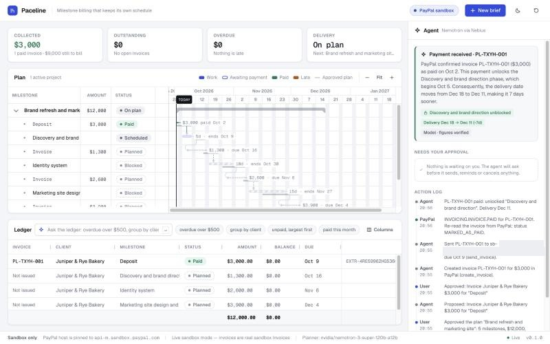

# Paceline

**Milestone billing that keeps its own schedule.** Paste a brief or statement of work. Paceline proposes a
milestone plan (deliverables, dates, amounts, which payment unlocks which work), draws it as a Gantt chart in
which *"invoice paid" is a real dependency*, and bills each milestone through PayPal once you approve. When
PayPal reports a payment, the plan moves by itself. When an invoice goes overdue, the agent reschedules
everything downstream, shows the knock-on effect on the delivery date and drafts a reminder for you to approve.

Built for freelancers and small studios who bill by milestone. Entry for the PayPal AI Hackathon.



**Demo video:** [`docs/demo.mp4`](docs/demo.mp4) (2 min 20 s, 1440x900, captions burned in; a 22-second excerpt is
[`docs/demo.gif`](docs/demo.gif)). It is a real take against the live PayPal sandbox: Nemotron plan, approval gate,
invoice sent through PayPal, the verified `INVOICING.INVOICE.PAID` webhook, the plan re-scheduling itself, then the
ledger and the overdue/reminder flow in the simulator. The payment in the recording is made with
`record-payment` (see [Recording the demo](#recording-the-demo)), not by a buyer logging in, and the video says so.
The recorder is [`scripts/record_demo.mjs`](scripts/record_demo.mjs).

> **Live at [paceline.gotclass.xyz](https://paceline.gotclass.xyz).** Every `SandboxGateway` call has been run
> against the real PayPal sandbox (2026-10-02), and the whole loop has run end to end on the public URL: brief →
> Nemotron plan → approved invoice created and sent in the sandbox → payment → real webhook, signature verified by
> PayPal → next milestone unlocked. Public visitors get the simulator; the owner unlocks the live sandbox for one
> browser at `/operator`. See [PayPal](#paypal) and [Live deployment](#live-deployment).

---

## Contents

- [Run it](#run-it)
- [The workflow](#the-workflow)
- [Principles and how they are enforced](#principles-and-how-they-are-enforced)
- [Architecture](#architecture)
- [PayPal](#paypal)
- [AI planner](#ai-planner)
- [Bryntum Gantt](#bryntum-gantt)
- [AG Grid](#ag-grid)
- [Design](#design)
- [Configuration and deployment](#configuration-and-deployment)
- [Live deployment](#live-deployment)
- [PayPal sandbox setup](#paypal-sandbox-setup)
- [Recording the demo](#recording-the-demo)
- [Tests](#tests)
- [Limits and known gaps](#limits-and-known-gaps)
- [Screenshots](#screenshots)
- [Credits and licence](#credits-and-licence)

---

## Run it

Requires Node **22.12 or newer**.

```bash
npm ci
npm run dev            # API + Vite dev server in one process: http://127.0.0.1:8791
```

With no configuration this runs in **simulator mode** with the **scripted planner**: no network calls at all,
no keys needed. The header says "Simulated PayPal — no sandbox calls made" and the footer repeats it.

| Command | What it does |
| --- | --- |
| `npm run dev` | Development server with hot reload (`tsx server/index.ts --dev`). |
| `npm run build` | Bundles the client (Vite, to `dist/client`) and the server (esbuild, to `dist/server/index.js`). |
| `npm start` | Production server: `node dist/server/index.js`, serves the API and the built client with a strict CSP. |
| `npm test` | 328 tests (Vitest). `npm run coverage` adds a coverage report. |
| `npm run typecheck` | `tsc --noEmit`. |

**Mock mode without a backend:** open `/?mock=1` (dev or production build). The same workflow engine runs
entirely in the browser with an in-memory simulator; the footer says "Mock mode: running in this browser,
no backend" and no `/api` request is made. Useful for design work and as a fallback demo.

To try it quickly: click **Load sample workspace** (one project with two paid invoices, one with an overdue
invoice and a reminder waiting for approval), or pick a sample brief and click **Propose a plan**. In
simulator mode, the ledger's **Pay as buyer** button plays the PayPal buyer, and **+1 day / +1 week** in the
header move the simulator clock so invoices can fall due.

## The workflow

1. **Brief to plan.** The planner turns the brief into a typed plan: milestones with working days, amounts,
   payment terms and gates (a milestone starts when another milestone's invoice is *paid*, or when another
   milestone is *delivered*; one with no gate starts on the start date).
   The plan is validated against a JSON schema and against the brief before it is shown
   ([`shared/plan.ts`](shared/plan.ts)): a stated total must appear in the brief and equal the sum of the
   milestones, a client email that is not in the brief is refused, and a plan whose total (or itemised amounts)
   cannot be found in the brief is flagged on the review screen.
2. **Review.** The plan opens in an editor (amounts, days, terms, gates). Nothing has been sent anywhere yet.
3. **Approve the plan.** The schedule is computed and frozen as the baseline. The agent proposes the first
   invoice. Invoices are created just in time, one milestone at a time (see [why](#paypal)).
4. **Approve the invoice.** One approval covers `create_invoice` + `send_invoice` with exactly the amount,
   dates and recipient shown on the card. The ledger row appears as *Awaiting*.
5. **Payment arrives.** PayPal sends `INVOICING.INVOICE.PAID`. The handler verifies the signature, drops
   duplicates, re-reads the invoice from PayPal, and the engine recomputes the schedule: the gated milestone
   unlocks (the Gantt highlights and scrolls to it), the ledger row flips to *Paid*, the KPI strip updates, and
   the agent explains what changed and by how many days the delivery date moved.
6. **Delivery.** Mark a milestone delivered and the agent proposes that milestone's invoice.
7. **Overdue.** When an invoice passes its due date unpaid, everything gated on it slides, the project row
   shows "+N d vs plan", and the agent drafts a reminder (editable) for approval. If the delivery date keeps
   slipping while you wait, the agent says so again ("Still overdue") without sending a second reminder.
8. **Ledger in plain language.** "overdue over $500", "group by client", "unpaid invoices for harbor over
   $1,000, largest first", "paid this month". The words become a validated `LedgerIntent` that drives AG Grid's
   filter model, row grouping and sort.

## Principles and how they are enforced

| Principle | Where it is enforced | Test |
| --- | --- | --- |
| **Human approval before anything that touches money or a client** (create/send invoice, reminder, cancel). The action log records who approved what. | [`shared/gate.ts`](shared/gate.ts): `GatedPayPal` is the only object that can call a gateway write method; each method takes a proposal id, refuses unless that proposal was approved, and reads amounts, dates, recipient and text from the approved proposal. Holds in the simulator too. | `tests/engine.test.ts` (approval gate cases, plus a source scan proving nothing else calls a write method) |
| **The model never invents amounts, dates, invoice ids or statuses.** | Plans: schema validation + grounding against the brief ([`shared/plan.ts`](shared/plan.ts)); a plan is only a proposal until the user approves it, and invoice ids, payments and statuses only ever come from PayPal responses. Prose: the no-invention guard ([`shared/guard.ts`](shared/guard.ts)) extracts every amount, date, id, number, email and status word from model text and rejects it if any is not in the facts built from the approved plan and PayPal responses; one retry with the violations listed, then deterministic template text. The UI marks which text is "Model · figures verified" and which is "Template". | `tests/guard.test.ts`, `tests/plan.test.ts`, `tests/nebius.test.ts` |
| **Sandbox only.** | `PAYPAL_SANDBOX_HOST = 'api-m.sandbox.paypal.com'` is a constant; every outgoing request re-checks its URL; `PACELINE_PAYPAL_HOST` / `PACELINE_PAYPAL_ENVIRONMENT`, if set to anything else, stop the server at start-up. The footer says "Sandbox only · PayPal host is pinned to api-m.sandbox.paypal.com". | `tests/config.test.ts`, `tests/sandbox.test.ts` |
| **Simulator labelled; live mode without credentials refuses to run.** | `PACELINE_PAYPAL_MODE=sandbox` without all three `PAYPAL_*` values exits with code 78; there is no fallback to the simulator. | `tests/config.test.ts` |
| **Only vendor-specific or `PACELINE_*` environment variables.** | [`server/config.ts`](server/config.ts) is the only file that reads `process.env`, through an allow-list that throws on any other name. After reading, every key-like variable is deleted from the process environment, so nothing the server starts can inherit it. | `tests/config.test.ts` (a process with `LLM_API_KEY`, `OPENAI_API_KEY`, `LLM_BASE_URL` set ends up with no key; scrub; source scan for `process.env`) |

## Architecture

```
                 browser (React + TypeScript, Vite)
  ┌──────────────────────────────────────────────────────────────┐
  │ KPI strip · Bryntum Gantt (plan) · AG Grid (ledger) · Agent   │
  │ panel (explanations, approvals, action log)                   │
  │ web/state.ts reducer  <── SSE events / snapshots              │
  │ Backend interface: HttpBackend | MockBackend (?mock=1)        │
  └───────────────┬──────────────────────────────────────────────┘
                  │ JSON API + SSE (same origin)
  ┌───────────────▼──────────────────────────────────────────────┐
  │ server/http.ts   routes, session cookie, per-IP rate limits,  │
  │                  CSP, static files, /healthz, webhook         │
  │ server/workspaces.ts  one Workspace per visitor session       │
  │ server/store.ts       JSON files (atomic writes)              │
  │                                                               │
  │ shared/engine.ts  Workspace: the whole workflow, isomorphic   │
  │   schedule.ts (pure scheduling) · plan.ts (schema+grounding)  │
  │   gate.ts (approvals) · guard.ts (no-invention) · prose.ts    │
  │   ledger.ts (rows + rule parser) · webhook.ts (verify, dedupe)│
  │                                                               │
  │ PayPalGateway ── SandboxGateway (REST, server/paypal)         │
  │              └─ PayPalSimulator (in memory, shared/paypal)    │
  │ Planner ──────── NebiusPlanner (server/planner)               │
  │              └─ ScriptedPlanner (shared/planner)              │
  └──────────────────────────────────────────────────────────────┘
```

- **One engine, two hosts.** `shared/engine.ts` (`Workspace`) holds the workflow: plan runs, approvals, PayPal
  calls through the gate, webhook application, overdue detection, explanations and the action log. The Node
  server hosts it with persistence and SSE; `?mock=1` hosts the same code in the browser. The server/client
  contract (state, events, API payloads) is one file: [`shared/contract.ts`](shared/contract.ts).
- **Scheduling is pure.** `computeSchedule(plan, facts, today)` in [`shared/schedule.ts`](shared/schedule.ts)
  has no I/O and no clock. Until PayPal says an upstream invoice is paid, the schedule projects its payment on
  the due date (or today, once overdue), so every late day visibly pushes downstream work. The approved
  schedule is kept as a baseline; the difference is the "+N d vs plan" figure. Bryntum renders these dates
  (`manuallyScheduled`), it does not compute them, so the Gantt and the engine can never disagree.
- **Persistence.** One JSON file per workspace plus the processed-webhook ids, written atomically
  (temp file + rename). SQLite would be the next step; `node:sqlite` is still experimental on Node 22.
- **Live updates.** `GET /api/events` is an SSE stream per session. The agent's progress (plan run steps,
  payment handling) and every state change are pushed; the client reducer ([`web/state.ts`](web/state.ts))
  applies them.
- **Sessions and isolation.** An `HttpOnly; SameSite=Lax` cookie (`Secure` behind https) (`paceline_sid`) maps a visitor to their
  own workspace. In simulator mode each workspace has its own simulator, signing secret and clock.
- **Abuse limits.** Per-IP token buckets per route class (read, write, agent), a semaphore capping concurrent
  model runs (`PACELINE_MAX_AGENT_RUNS`, default 2), caps on live workspaces and SSE clients, body size limits,
  request timeouts, Origin checks on writes.
- **CSP.** The production page is served with `default-src 'self'; script-src 'self'; style-src 'self'
  'nonce-…'; style-src-attr 'unsafe-inline'; img-src 'self' data:; font-src 'self' data:; connect-src 'self';
  object-src 'none'; base-uri 'none'; form-action 'self'; frame-ancestors 'none'`. Fonts (Geist, Geist Mono),
  icons and both vendor libraries are bundled; nothing is fetched from another origin at runtime. The style
  nonce is for AG Grid's injected theme stylesheet; `style-src-attr` and `data:` are needed by the inline
  style attributes and SVG icons both grids use. Verified in the production build: no violations.
- **Size.** The hashed assets are gzipped once at start-up and cached; the first load is about 2.4 MB on the
  wire (Bryntum 1.8 MB, AG Grid 0.4 MB, app 0.1 MB).

```
shared/   contract, engine, schedule, plan, guard, gate, prose, ledger, webhook, sample, money, dates,
          paypal/{gateway, simulator}, planner/{types, scripted}
server/   index (entry), config (env rule), http (incl. /operator), workspaces, store, rateLimit,
          budget (model spend guard), toolcall (Ajv), paypal/sandbox (REST), planner/nebius
web/      main, App, state (reducer), backend/{http, mock}, gantt/{BryntumGantt, model, Fallback},
          ledger/{Ledger, intent}, components/{AgentPanel, Composer, PlanEditor}, styles/
tests/    14 files
scripts/  try-sandbox.ts (real sandbox verification and operator tools), try-nebius.ts (a handful of
          real model calls for prompt tuning), set-paypal-secrets.sh; none are part of the tests
```

## PayPal

All PayPal access goes through one interface, `PayPalGateway`
([`shared/paypal/gateway.ts`](shared/paypal/gateway.ts)), with two implementations:

- **`PayPalSimulator`** ([`shared/paypal/simulator.ts`](shared/paypal/simulator.ts)): keeps invoices in memory
  with PayPal's statuses and response shapes, assigns ids like `INV2-…`, and on "Pay as buyer" emits an
  `INVOICING.INVOICE.PAID` event signed with a per-workspace HMAC secret. That event is delivered through the
  **same** webhook handler as a real delivery, so verification, deduplication and the plan update are
  exercised end to end.
- **`SandboxGateway`** ([`server/paypal/sandbox.ts`](server/paypal/sandbox.ts)): Invoicing v2 over REST
  against `api-m.sandbox.paypal.com`, verified against the real sandbox and unit-tested against the response
  shapes the sandbox actually returned.

**Verified against the real PayPal sandbox** with [`scripts/try-sandbox.ts`](scripts/try-sandbox.ts) (`all`
runs every call below on two tagged test invoices addressed to the sandbox buyer) and through the deployed app:

| Tool name | Call | Verified | Result |
| --- | --- | --- | --- |
| (auth) | `POST /v1/oauth2/token` | 2026-10-02 | 200; token cached until shortly before `expires_in`, single-flight refresh |
| `create_invoice` | `POST /v2/invoicing/invoices` | 2026-10-02 | 201, DRAFT; `Prefer: return=representation`; `PayPal-Request-Id` |
| `send_invoice` | `POST /v2/invoicing/invoices/{id}/send` | 2026-10-02 | 200 SENT (202 SCHEDULED when the invoice date is in the merchant's future, see below) |
| `get_invoice` | `GET /v2/invoicing/invoices/{id}` | 2026-10-02 | 200, including a `MARKED_AS_PAID` invoice with an `EXTERNAL` payment |
| `send_invoice_reminder` | `POST /v2/invoicing/invoices/{id}/remind` | 2026-10-02 | 204, empty body |
| `cancel_sent_invoice` | `POST /v2/invoicing/invoices/{id}/cancel` | 2026-10-02 | 204, then `get` returns CANCELLED |
| (webhooks) | `POST /v1/notifications/verify-webhook-signature` | 2026-10-02 | `FAILURE` for a fabricated delivery; `SUCCESS` for the real `INVOICING.INVOICE.PAID` delivery in the end-to-end run. The raw body is spliced in unparsed, so the signature is checked over the exact bytes PayPal signed |
| (operator tool) | `POST /v2/invoicing/invoices/{id}/payments` | 2026-10-02 | 200 `{payment_id: "EXTR-…"}`; the invoice becomes `MARKED_AS_PAID` and PayPal **does** deliver `INVOICING.INVOICE.PAID` (one event, no `UPDATED`, under a minute) |

**What the real sandbox disagreed with, and the fixes:**

- **Invoice dates are read in the merchant's time zone.** Dates were computed in UTC. In the evening (US
  time) that is already tomorrow for PayPal, so `send` answered 202 `SCHEDULED` instead of 200 `SENT`, and
  `remind` and `cancel` then failed with 422 `CANNOT_REMIND_INVOICE` / `CANNOT_CANCEL_SCHEDULED_INVOICE`. "Today"
  is now computed in `PACELINE_TIMEZONE` (default `America/Los_Angeles`) for invoice dates and the schedule, and
  cancelling a `SCHEDULED` invoice is refused up front with a clear message.
- **`webhook_id` must be alphanumeric.** `verify-webhook-signature` rejects anything else with 400; the config
  now refuses a malformed `PAYPAL_WEBHOOK_ID` at start-up, and the test fixtures use real-format ids.
- **PayPal reuses a client-credentials token until it expires** (about 9 hours), so a feature enabled on the app
  afterwards (Invoicing) does not appear in the token's scope. `try-sandbox.ts refresh-token` revokes it once
  (`POST /v1/oauth2/token/terminate`) so the next token carries the new scope.
- **The invoice `reference` is visible to the recipient**, and it carried the workspace id, which is also the
  visitor's session cookie. It now carries the public workspace tag instead (webhooks were always routed by
  invoice id, never by the reference).
- Found along the way (not a PayPal disagreement): a billing-only milestone (the deposit) was rolled to the next
  working day like work is, which pushed a Saturday deposit's invoice date to Monday. Only work rolls now.
- Also confirmed: the request bodies (`primary_recipients`, the amount breakdown, `DUE_ON_DATE_SPECIFIED` payment
  terms) were accepted as written; the webhook events list endpoint (`GET /v1/notifications/webhooks-events`)
  returned no events for the app even after a successful delivery, so it is not relied on.

**Webhooks drive the plan.** `POST /api/webhooks/paypal` ([`shared/webhook.ts`](shared/webhook.ts)):
verify the signature first (reject with 401 if invalid; answer 500 so PayPal retries if the verifier is
unreachable), parse, drop duplicates by event id (persisted, plus an in-flight set for concurrent retries),
take only the invoice id from the payload, route it to the workspace that owns the invoice, re-read the
invoice with `get_invoice`, apply. The event id is recorded only after it was applied, so a failure is retried.
Transaction Search and disputes are not used.

**Why direct REST rather than the PayPal Agent Toolkit at runtime.** The toolkit (`@paypal/agent-toolkit`
1.11.0) was evaluated. It derives its OAuth host as `api.sandbox.paypal.com` with no way to pin
`api-m.sandbox.paypal.com`, caches the access token without expiry (sandbox tokens last about 9 hours), flattens
API errors to strings (no status, no `debug_id`), has no webhook verification, and is designed to hand write
tools directly to a model, which is the opposite of the approval gate. Paceline keeps the toolkit's tool names
(`create_invoice`, `send_invoice`, `send_invoice_reminder`, `cancel_sent_invoice`, `get_invoice`) so the
vocabulary in the UI and the action log is PayPal's.

**Just-in-time invoices.** Invoices are created when a milestone becomes billable (create + send under one
approval), not all as drafts at plan approval: draft dates go stale as soon as the schedule moves, and a
cancelled-and-recreated draft trail is noise in the merchant's PayPal account.

**Several visitors on one sandbox merchant account.** Live sandbox mode necessarily shares one merchant
account between all visitors, so isolation is enforced by Paceline, not PayPal
([`server/workspaces.ts`](server/workspaces.ts)): a workspace only reads invoices it created (by id, never by
listing the account); invoice numbers carry a per-workspace tag (`PL-XXXX-001`); webhooks are routed by an
invoice-to-workspace index and events for unknown invoices are acknowledged and ignored; every invoice is
addressed to the one configured sandbox buyer (`PACELINE_SANDBOX_BUYER_EMAIL`) whatever email the brief
contains, so no real address ever receives sandbox mail; "Load sample workspace" and the simulator clock are
disabled; the per-IP limits and the cap on concurrent model runs apply as usual. What live workspaces do share
is the sandbox buyer's inbox and the merchant's invoice list in PayPal's own dashboard.

**Who gets the live sandbox** (`PACELINE_SANDBOX_ACCESS`). With `everyone`, every workspace is live; that is
for local use, and the server refuses to start with it on a public URL unless it is set explicitly. With
`operator` (the default once `PACELINE_OPERATOR_TOKEN` is set, and what the public deployment runs), visitors
always get the simulator, and only a browser unlocked at `/operator` gets a live workspace. That workspace
records a fingerprint of the token, so rotating the token drops every live workspace back to the simulator. The
details are under [Live deployment](#live-deployment).

## AI planner

- **Model:** NVIDIA Nemotron (`nvidia/nemotron-3-super-120b-a12b`) on Nebius Token Factory through its
  OpenAI-compatible API (`https://api.tokenfactory.nebius.com/v1/`), key from `NEBIUS_API_KEY`
  ([`server/planner/nebius.ts`](server/planner/nebius.ts)).
- **What the model does:** proposes plans as a structured tool call (`propose_plan`), writes short
  explanations and reminder drafts, and turns ledger questions into a `LedgerIntent`. It never calls PayPal and
  never sees a write tool.
- **Tool calls are validated, and errors go back to the model.** Every tool call is checked against its JSON
  schema with Ajv ([`server/toolcall.ts`](server/toolcall.ts)); unknown tools and invented arguments (the model
  has been seen passing `limit` where no such argument exists) are rejected and the error text is fed back so
  it can correct itself, up to three attempts. Then the plan goes through the same validation and grounding as
  any other plan.
- **Findings from real calls** (35 calls through `scripts/try-nebius.ts`, about $0.03 in total):
  - The serving stack renders JSON `null` tool arguments as the string `"None"`. Before handling this, every
    plan failed all three attempts (the model repeats itself when told). `normalizeNulls` maps
    `None`/`null`/`n/a`/empty strings to `null` **only where the schema allows null**. After the fix, 4 of 4
    sample briefs produced a valid plan on the first call.
  - The model split amounts into odd cents and invented a split for "half up front, rest on launch". The prompt
    now asks for amounts in multiples of 50 with the remainder on the last milestone and to follow the brief's
    payment schedule; the validator rejects zero-amount milestones with an explanation the model can act on.
  - The guard first rejected harmless phrases ("a reminder draft", "is now scheduled for") as status claims.
    Status words are now two-tier: `paid`, `unpaid`, `overdue`, `cancelled`, `refunded` are always checked;
    `sent`, `draft`, `scheduled`, `pending` only when used as a status ("is sent", "status: draft").
- **Spend guard** ([`server/budget.ts`](server/budget.ts)). On a public URL anyone can press "Propose a plan",
  so every model call goes through a metered fetch that reads the `usage` block and prices it (Nemotron Super on
  Nebius: $0.30 / $0.90 per million input / output tokens). A global daily dollar cap and call cap
  (`PACELINE_MODEL_DAILY_USD`, `PACELINE_MODEL_DAILY_CALLS`, kept on disk so a restart does not reset them) and a
  per-IP hourly allowance of model runs (`PACELINE_MODEL_RUNS_PER_IP_HOUR`) apply. Past a limit, the plan comes
  from the rule-based planner and the prose from templates, and the UI says so; a guard retry inside a run that
  was already admitted is not charged again. The same fallback applies when the provider itself fails (HTTP 402
  out of credit, 5xx, network error or timeout, raised as `ModelUnavailable`): the plan is drafted by the rule-based
  planner, the plan warning, the plan editor footer and the run step say so, and nothing is hidden. A model answer
  that is simply bad is still an error, not a silent fallback. The whole live end-to-end run used 3 model calls, about $0.003.
- **No key, no model.** Without `NEBIUS_API_KEY` (or with `PACELINE_PLANNER=scripted`) the scripted planner
  ([`shared/planner/scripted.ts`](shared/planner/scripted.ts)) parses briefs with rules, and explanations come
  from templates. The tests use it exclusively and never touch the network. The UI says which planner is active.

## Bryntum Gantt

The plan is a Bryntum Gantt ([`web/gantt/BryntumGantt.tsx`](web/gantt/BryntumGantt.tsx), data from
[`web/gantt/model.ts`](web/gantt/model.ts)):

- Each milestone is a **work bar** plus an **invoice bar**; dependency lines run work → invoice → next work.
  The "paid" gate is a real dependency: dashed while the payment is open, green once PayPal confirms it.
- **Baselines** show the approved plan wherever the schedule has moved; the project row carries "+N d vs plan".
- Weekend shading, a today line, figure labels on bars ("$4,500 paid Sep 3", "10d · ends Oct 6"), tooltips,
  a "mark delivered" action on work in progress.
- A milestone that a payment has just unlocked is highlighted and scrolled into view: the motion explains the
  state change.
- Own fit-to-width time axis with zoom controls (Bryntum's `zoomToFit` picked levels that left bars tiny);
  narrower layouts drop the amount column.
- Themed entirely with CSS variables from the same tokens as the rest of the app, in both themes
  ([`web/styles/bryntum.css`](web/styles/bryntum.css)). Bryntum is the vanilla build driven from a React
  effect; the React wrapper added nothing here.
- If the Gantt fails to load, an error boundary swaps in a plain timeline
  ([`web/gantt/Fallback.tsx`](web/gantt/Fallback.tsx)) built from the same model (`?gantt=fallback` forces it).

**Licensing (owner action needed).** The package is Bryntum's public **trial**, installed from public npm with
no account: `"@bryntum/gantt": "npm:@bryntum/gantt-trial@^7.3.7"`. Observed trial behaviour:

- a tiled "Trial Version" watermark behind the grid and timeline (visible in the screenshots);
- the console prints "Bryntum Gantt 7.3.7 Trial";
- the trial records its start in `localStorage` (`b-gantt-trial-start`, `b-gantt-hash`, `b-gantt-verify-date`)
  and contains code that masks the component once the trial has expired;
- about a minute after load it requests an image beacon `https://bryntum.com/verify/?id=…&url=<page url>`.
  Under Paceline's CSP this request is **blocked** (`img-src 'self'`) and logged as a console error; without the
  CSP (plain `vite` dev) it goes out.

To remove all of this, the owner needs a Bryntum licence (or the sponsor's hackathon licence) and must switch
the alias to the licensed package from Bryntum's private npm registry, which requires their own login
(`npm login --registry=https://npm.bryntum.com`). The import path stays `@bryntum/gantt`, so no code changes.

## AG Grid

The ledger is AG Grid 36 ([`web/ledger/Ledger.tsx`](web/ledger/Ledger.tsx)), themed with the Theming API
(`themeQuartz.withParams`) from the same design tokens, in light and dark:

- custom cell renderers: status pills, due date with "in N d"/overdue colouring, amounts in tabular mono,
  PayPal payment id, row actions (Pay as buyer in the simulator; Open as buyer in sandbox mode; cancel);
- the plain-language bar: the query becomes a validated `LedgerIntent`, mapped by
  [`web/ledger/intent.ts`](web/ledger/intent.ts) to AG Grid's filter model, row grouping and sort state; an
  answer line says what was applied and by whom (model or rule parser), with Clear;
- a pinned totals row, cell flash when a row changes (the "flips to paid" moment), a focus layout that gives
  the ledger more room when it is grouped or a tool panel is open.

**Community vs Enterprise.** Filtering, sorting, custom renderers, pinned rows, theming and cell flashing are
Community. Paceline uses Enterprise modules only where they earn their place:

| Enterprise module | Why |
| --- | --- |
| `RowGroupingModule`, `RowGroupingPanelModule` | "group by client" / "group by status" with group totals and a drag-to-group panel |
| `SetFilterModule` | status filters ("overdue", "unpaid" = awaiting + overdue) as value sets |
| `SideBarModule`, `ColumnsToolPanelModule`, `FiltersToolPanelModule` | the Columns/Filters panel behind the Columns button |

The AG Grid AI Toolkit was not used: Paceline's own `LedgerIntent` is small, schema-validated, and works
without a model (rule parser), which the toolkit does not.

**Licensing (owner action needed).** Without a key, AG Grid Enterprise runs fully unlocked as a trial, prints a
"License Key Not Found" banner in the console, and adds a watermark element (hidden on localhost, expected to
show on a public domain). The owner should request a trial or hackathon key from AG Grid and set
`PACELINE_AG_GRID_LICENSE_KEY` in the runtime environment. The server writes it into the page at request time,
so it is never committed and never baked into the build or the Docker image. (AG Grid keys are client-side by
design: any page using one ships it to the browser.)

## Design

- **Type:** Geist for text, Geist Mono for figures (amounts, dates, ids), bundled. A fixed type scale (11–28 px)
  and a 4 px spacing scale in [`web/styles/tokens.css`](web/styles/tokens.css).
- **Colour:** a restrained neutral base with one blue accent; meaning colours only for meaning (green paid,
  amber/orange late, blue in progress). Light and dark themes are token swaps (`data-theme`), following the OS
  by default with a toggle; the Gantt and the ledger use the same tokens so they read as one product.
- **States:** a designed empty state with sample briefs, skeletons while loading, inline errors and toasts,
  "Nothing is waiting on you" when the approval queue is empty, an explicit not-understood answer in the ledger.
- **Motion** only where it explains a change: unlock highlight and scroll on the Gantt, row and KPI flash on
  payment, focus-layout transitions; all disabled under `prefers-reduced-motion`.
- **Layout:** designed at 1440 and 1280 (three regions: KPIs + plan + ledger, and the agent panel); single column
  and fully usable at 768. Fixed heights for the grids, so nothing shifts as data arrives.

## Configuration and deployment

All settings are environment variables; the full list with comments is in [`.env.example`](.env.example).
Only `NEBIUS_API_KEY`, `PAYPAL_CLIENT_ID`, `PAYPAL_CLIENT_SECRET`, `PAYPAL_WEBHOOK_ID`, `PORT` and `PACELINE_*`
are read. Generic names such as `LLM_API_KEY`, `OPENAI_API_KEY` or `LLM_BASE_URL` are ignored even when set.

```bash
cp .env.example .env               # .env is git-ignored
npm run build
node --env-file=.env dist/server/index.js
```

**Docker** (multi-stage on `node:22-slim`, runs as the non-root `node` user, data in a volume, keys only from the
runtime environment; the runtime stage contains `dist/` and `package.json` only, because the server bundle has
no npm dependencies left):

```bash
docker build -t paceline .
docker run --rm -p 8791:8791 -v paceline-data:/data --env-file .env paceline
```

Behind a reverse proxy, set `PACELINE_PUBLIC_URL=https://your.host` (secure cookie, allowed Origin) and
`PACELINE_TRUST_PROXY=1` (client IP from `X-Forwarded-For` / `CF-Connecting-IP` for the rate limits).
`GET /healthz` reports mode, sandbox access, planner, uptime and load, never secrets.

## Live deployment

**URL:** [https://paceline.gotclass.xyz](https://paceline.gotclass.xyz), running in sandbox mode with
`PACELINE_SANDBOX_ACCESS=operator` and the Nemotron planner behind the spend guard.

**The safety problem.** A sandbox deployment holds one sandbox merchant's credentials. If every visitor got a
live workspace, anyone could make that merchant create invoices and send PayPal emails, without limit.

**The design: the public gets the simulator; the owner unlocks the live sandbox for one browser.**

- Visitors' workspaces always use the in-memory simulator, even though the server runs in sandbox mode. They can
  do the whole flow (plan, approve, pay as buyer, move the clock), and no request of theirs reaches PayPal. The
  header says "Simulated PayPal".
- `GET /operator` is a script-free page with its own strict CSP. Posting the operator token
  (`PACELINE_OPERATOR_TOKEN`, compared in constant time against its SHA-256) switches **that browser's** session
  to a fresh live sandbox workspace; "Back to the simulator" switches it back. Unlock attempts share a rate limit
  of 5, then one a minute, per IP; posts must be same-origin form posts.
- **Pairing**, so the token never has to be typed into the browser being recorded: below the token form,
  `/operator` shows a pairing code (8 characters, valid 10 minutes). Submitting the token with that code from a
  terminal unlocks the browser that is showing it; reload that page afterwards:
  ```bash
  TOK="$(awk -F= '/^PACELINE_OPERATOR_TOKEN=/{print substr($0,index($0,"=")+1)}' .env)" && \
  curl -s -o /dev/null -w '%{http_code}\n' -X POST -H 'origin: https://paceline.gotclass.xyz' \
    --data-urlencode "token=$TOK" --data-urlencode "code=ABCD-EFGH" https://paceline.gotclass.xyz/operator; unset TOK
  ```
  (200 means paired; 404 unknown or expired code; 401 wrong token.)
- Webhooks are verified per invoice: an invoice of a live workspace must be vouched for by PayPal
  (`verify-webhook-signature`), a simulator invoice by its workspace's own HMAC, and anything else is checked with
  PayPal and then acknowledged and ignored.
- Model spend is capped as described under [AI planner](#ai-planner). The deployment runs with $0.20 and 200
  calls a day and 12 model runs per IP per hour, plus at most 2 concurrent runs.

**Host.** One container on the owner's server, built from the source there:

- Source in `/opt/paceline/src` (rsync without `node_modules`, `dist`, `.env*`, `data`), image built on the host,
  container `paceline` with `--restart unless-stopped`, bound to `127.0.0.1:8791`, environment from
  `/opt/paceline/runtime.env` (mode 600), data in the `paceline-data` volume.
- Hardening: `--memory 256m --memory-swap 384m --cpus 1 --pids-limit 128 --read-only --tmpfs /tmp:size=16m
  --cap-drop ALL --security-opt no-new-privileges`, log rotation 3 × 10 MB, non-root `node` user. It idles at
  about 25 MiB.
- Public hostname through the host's existing Cloudflare tunnel: an ingress rule for `paceline.gotclass.xyz`
  before the final `http_status:404`, validated with `cloudflared tunnel ingress validate`, DNS by
  `cloudflared tunnel route dns`. `PACELINE_PUBLIC_URL=https://paceline.gotclass.xyz` and
  `PACELINE_TRUST_PROXY=1` are set.
- Redeploy: rsync the source, then `docker build` and `docker run` with the same flags (workspaces and the model
  budget survive in the volume).

## PayPal sandbox setup

Done by the owner in their own PayPal developer account:

1. Sign in at [developer.paypal.com](https://developer.paypal.com) and switch the dashboard to **Sandbox**.
2. **Testing Tools → Sandbox Accounts:** use (or create) one **Business** account (the merchant that sends
   invoices) and one **Personal** account (the buyer). Note the Personal account's email; its password is under
   *View/Edit account* and is what you use to pay on sandbox.paypal.com.
3. **Apps & Credentials → Create App:** type *Merchant*, linked to the sandbox Business account. Copy the
   **Client ID** and **Secret**.
4. In the app's **Features**, make sure **Invoicing** is ticked. Nothing else is needed: Paceline does not use
   Payouts, Disputes, Transaction Search, Vault or Log in with PayPal.
5. Store the client id, secret and the buyer's email with `scripts/set-paypal-secrets.sh` (hidden prompts,
   writes `.env` at mode 600, prints only lengths).
6. Register the webhook. Either in the app's **Webhooks** page, or with the script, which lists the app's
   webhooks first, reuses one with the same URL, never touches the others, subscribes to
   `INVOICING.INVOICE.PAID`, `CANCELLED`, `REFUNDED` and `UPDATED`, and stores the id as `PAYPAL_WEBHOOK_ID` in
   `.env`:
   ```bash
   npx tsx --env-file=.env scripts/try-sandbox.ts create-webhook https://<public host>/api/webhooks/paypal
   ```
   The URL must be public HTTPS (for a local machine, use a tunnel).
7. Run with:
   ```
   PACELINE_PAYPAL_MODE=sandbox
   PAYPAL_CLIENT_ID=…
   PAYPAL_CLIENT_SECRET=…
   PAYPAL_WEBHOOK_ID=…
   PACELINE_SANDBOX_BUYER_EMAIL=<the Personal sandbox account's email>
   PACELINE_PUBLIC_URL=https://<public host>
   PACELINE_OPERATOR_TOKEN=<random, 24+ characters>     # required on a public URL, see Live deployment
   ```

`scripts/try-sandbox.ts` (operator tool; secrets are never printed, emails and ids are redacted):

| Command | Does |
| --- | --- |
| `all [-v]` | runs every `SandboxGateway` call against the sandbox on two tagged test invoices (`PL-TRY…`) |
| `scope` / `refresh-token` | shows whether the token carries the Invoicing scope / revokes the cached token |
| `webhooks` / `create-webhook <url>` | lists the app's webhooks / registers one (see step 6) |
| `get <INV2-id or PL-number>` | prints an invoice (redacted); a `PL-…` number is found with `POST /v2/invoicing/search-invoices` |
| `record-payment <INV2-id or PL-number>` | records an external payment for the full amount due (`MARKED_AS_PAID`; fires `INVOICING.INVOICE.PAID`) |
| `events [n]` | PayPal's list of webhook events for the app (returned nothing in practice) |

Run any of them as `npx tsx --env-file=.env scripts/try-sandbox.ts <command>`.

## Recording the demo

`scripts/record_demo.mjs` records `docs/demo.mp4` unattended with a throwaway headless Chrome (temporary profile).
It pairs the live sandbox from the terminal (the operator token never reaches the browser, the page or the video),
redacts the sandbox buyer's e-mail in every frame, pays the invoice with `record-payment`, and returns the browser
to the simulator at the end. `LIVE=1 REQUIRE_MODEL=1 node scripts/record_demo.mjs` for the real thing; without
`LIVE` it runs against `APP_URL` (a local dev server on 8793 by default, the simulator). The manual steps below are what the script automates,
with a real buyer payment in place of step 6.

The real "pay as buyer" click happens on sandbox.paypal.com, logged in as the sandbox Personal account. Only
the owner does this (Paceline never holds the buyer's password).

1. **Unlock a live workspace** in the browser you will record. Open
   [paceline.gotclass.xyz/operator](https://paceline.gotclass.xyz/operator) and either paste
   `PACELINE_OPERATOR_TOKEN` from `.env` into the form and press **Unlock the live sandbox**, or keep the token
   off screen with the pairing command under [Live deployment](#live-deployment) and reload. The header badge
   reads **PayPal sandbox** and the footer "Live sandbox mode — invoices are real sandbox invoices". Each unlock
   starts an empty workspace, so a retake is: `/operator` → Back to the simulator → unlock again.
2. **Plan.** Click a sample brief (e.g. *Brand refresh · $12,000*) and **Propose a plan**. Nemotron answers in
   about 10 seconds; review the milestones and press **Approve plan**.
3. **Invoice.** Under *Needs your approval*, the deposit invoice shows the exact PayPal calls. Press
   **Approve & send invoice**. The ledger row gets a `PL-XXXX-001` number, status *Awaiting*, and an
   **Open as buyer** button. (The approval card and action log show the sandbox buyer's email; crop or blur it if
   you prefer.)
4. **Pay as the buyer.** Click **Open as buyer** (opens the invoice on www.sandbox.paypal.com in a new tab). Log
   in with the sandbox **Personal** account (email and password: developer.paypal.com → Testing Tools → Sandbox
   accounts → the Personal account → *View/Edit account*), and pay with the PayPal balance. If PayPal reports
   insufficient funds, raise the account's balance on that same page or choose a brief with a smaller deposit.
5. **Back to Paceline.** Switch back to the Paceline tab and wait. In the test run the webhook arrived in under a
   minute: the agent card shows "Webhook INVOICING.INVOICE.PAID verified", the deposit turns *Paid*, the next
   milestone changes from *Blocked* to *Scheduled*, and the agent explains the new delivery date.
6. **Fallback** if the buyer payment is not possible on the day:
   `npx tsx --env-file=.env scripts/try-sandbox.ts record-payment PL-XXXX-001` with the invoice number from the
   ledger (it is looked up with PayPal's invoice search). PayPal marks the invoice paid and delivers the same
   `INVOICING.INVOICE.PAID` webhook; the status reads `MARKED_AS_PAID` instead of `PAID`.
7. Afterwards, `/operator` → **Back to the simulator**. Test invoices stay in the sandbox merchant's invoice list
   (they are tagged `PL-…` and can be cancelled from PayPal's dashboard).

## Tests

328 tests in 14 files, all offline (no network, no keys): `npm test`. Coverage over the logic modules
(`shared/`, `server/`, the client reducer, backends and view adapters): about 86% of statements and 90% of lines
(`npm run coverage`).

| File | Covers |
| --- | --- |
| `plan.test.ts` | plan schema, grounding against the brief, zero/odd amounts, gate validation |
| `guard.test.ts` | no-invention guard: amounts, dates, ids, numbers, emails, status words in and out of context |
| `schedule.test.ts` | payment-gated scheduling, overdue projection, knock-on days, baselines, working days, weekend deposits, merchant time zone |
| `engine.test.ts` | the whole workflow, approval gate (incl. a source scan), explanations vs the guard, overdue re-telling, time zone, SCHEDULED invoices, the reference carries no session id |
| `webhook.test.ts` | signature verification path (raw body), duplicates, concurrent retries, routing, invoice parsing |
| `sandbox.test.ts` | REST client against the shapes the real sandbox returned: host pinning, token caching, request bodies, 202 SCHEDULED, 422 bodies, MARKED_AS_PAID, errors |
| `config.test.ts` | env allow-list, generic variables ignored, scrub, sandbox-only start-up refusals, webhook id format, operator access, time zone, budget |
| `nebius.test.ts` | tool-call validation and feedback, `"None"` arguments, guard retries, fallbacks |
| `budget.test.ts` | model spend guard: metering, daily caps that survive a restart, per-IP runs, fallback to the rule-based planner |
| `http.test.ts` | API, sessions, rate limits, SSE, webhook endpoint, CSP and nonce, static files and gzip; operator mode (visitors stay simulated, unlock, pairing, token rotation, browser `Origin: null` form posts) |
| `ledger.test.ts`, `view.test.ts` | ledger rows and rule parser; Gantt model and ledger intent → AG Grid state |
| `client.test.ts` | client reducer, SSE parser, MockBackend |
| `store.test.ts` | JSON persistence |

Browser verification (simulator mode, production build with the CSP, and `?mock=1`): the full flow at 1440 and
1280 in light and dark, and at 768. On the live deployment: the full sandbox flow at 1440, and the `/operator`
forms in a real browser. See [Screenshots](#screenshots).

## Limits and known gaps

- A payment made by the buyer on sandbox.paypal.com (status `PAID`) has not been exercised by the automated
  run, which may not sign in as the buyer; it used a recorded payment (`MARKED_AS_PAID`), which fires the same
  `INVOICING.INVOICE.PAID` event and goes through the same handler. Both statuses unlock the next milestone.
- If a webhook never arrives (PayPal sandbox delivery is not guaranteed), there is no polling fallback; the
  invoice stays *Awaiting* until the next delivery attempt.
- In live sandbox mode the clock cannot be moved, so the overdue path happens in real time (choose short payment
  terms for a demo) or is shown in simulator mode.
- One currency per plan; no taxes, discounts or partial payments in the plan editor (PayPal partial payments are
  read and shown as paid amounts but do not unlock a milestone).
- JSON-file persistence suits one instance; several instances would need a shared database and a shared
  webhook-id store.
- Reminder and cancellation emails are sent by PayPal; Paceline does not send email itself.
- The trial watermarks of Bryntum and AG Grid remain until the owner installs licences (see above).

## Screenshots

In [`docs/screenshots/`](docs/screenshots/). 01 to 14 are from simulator mode; 15 to 18 are the live
sandbox run on the public URL (2026-10-02; the sandbox buyer's email is masked):

| | |
| --- | --- |
| `01-empty-state-light-1440` | first run: sample briefs and the sample workspace |
| `02-plan-review-light-1440` | the proposed plan in the review editor |
| `03-approval-gate-light-1440` | plan approved, first invoice waiting for approval with the exact PayPal calls |
| `04-invoice-sent-light-1440` | invoice sent, ledger row awaiting payment |
| `05-payment-unlocks-next-milestone-light-1440` | the demo moment: payment received, next milestone unblocked, delivery 7 days sooner |
| `06-overdue-reschedule-and-reminder-light-1440` | overdue invoice, downstream rescheduled (+4 d), reminder draft |
| `07-ledger-group-by-client-light-1440` | "group by client" in the ledger |
| `08-overdue-dark-1440`, `09-overdue-dark-1280`, `10-overdue-light-1280` | themes and widths |
| `11-tablet-768-agent`, `12-tablet-768-plan-and-ledger` | 768 px layout |
| `13-mock-mode-after-payment-light-1440` | `?mock=1`, no backend |
| `14-payment-unlock-dark-1280` | payment unlock in dark |
| `15-live-sandbox-plan-review-nemotron-1440` | live: the plan Nemotron proposed for the brand-refresh brief |
| `16-live-sandbox-invoice-approval-1440` | live: the deposit invoice waiting for approval, with the exact PayPal calls |
| `17-live-sandbox-invoice-sent-1440` | live: `create_invoice` + `send_invoice` done, real sandbox invoice awaiting payment |
| `18-live-sandbox-webhook-paid-unlocks-next-1440` | live: verified `INVOICING.INVOICE.PAID` webhook, deposit paid, next milestone unlocked, delivery 7 days sooner |

## Credits and licence

Built with AI coding assistance (Claude Code).

Code: [MIT](LICENSE). Bryntum Gantt and AG Grid Enterprise are commercial products used under their trial
terms; see their licences. Fonts: Geist and Geist Mono (SIL Open Font License).
